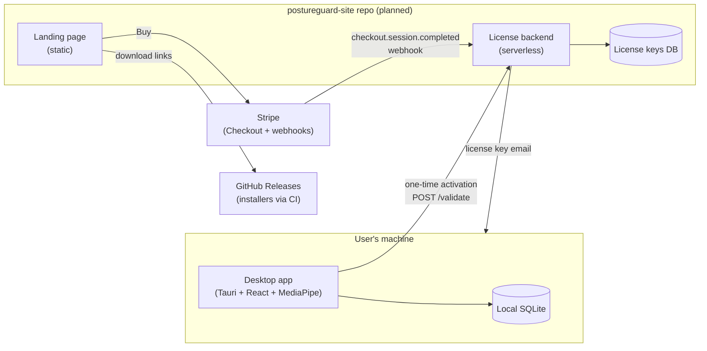
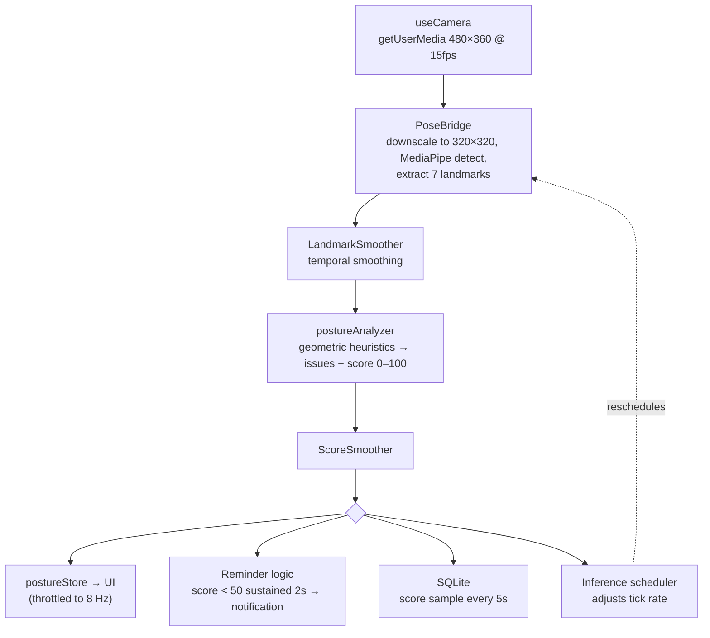
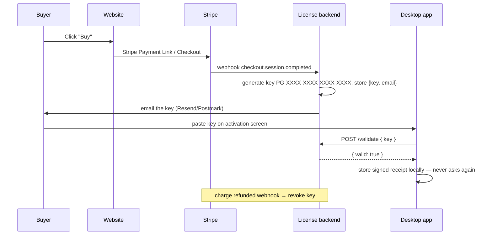

# PostureGuard — Architecture

PostureGuard is a privacy-first desktop app that monitors sitting posture through the
webcam, scores it in real time using on-device ML, and reminds the user to correct it.
No video, images, or posture data ever leave the machine.

This document describes the architecture of the whole product: the desktop app that
exists today, and the commercial layer (licensing, website, payments) planned around it.

---

## 1. System landscape

The product consists of three parts, in two repositories:



| Component | Status | Stack | Hosting |
|---|---|---|---|
| Desktop app | **Built** (this repo) | Tauri 2, React 19, MediaPipe | User's machine; installers on GitHub Releases |
| Website | Scaffolded (`postureguard-site`) | Static HTML, no build step | Vercel |
| License backend | Scaffolded (`postureguard-site`) | Vercel serverless functions + Upstash Redis (REST, no SDK) | Vercel |
| Payments | Planned | Stripe Checkout (Payment Link) + Stripe Tax | Stripe |

Two repos, because the app and the website share no code and have different release
rhythms: this repo ships tagged desktop releases through a slow multi-OS CI build,
while the website deploys on every push. The license backend lives in the website repo
as its API routes.

---

## 2. Desktop app

### 2.1 Tech stack

- **Shell:** Tauri 2 — Rust host process + OS WebView. Plugins: `notification`,
  `autostart` (launches with `--minimized`), `sql` (SQLite).
- **UI:** React 19 + TypeScript, Vite 6, Tailwind CSS 3 (dark theme only),
  Recharts for trend charts.
- **State:** Zustand — `settingsStore` (persisted to localStorage) and
  `postureStore` (ephemeral runtime state).
- **ML:** MediaPipe Pose Landmarker (lite `.task` model) via
  `@mediapipe/tasks-vision`, WASM runtime, GPU delegate with CPU fallback.
  Model and WASM are bundled with the app — no network fetch at runtime.

### 2.2 The Rust shell (`src-tauri/`)

Deliberately thin — all logic lives in the webview. `lib.rs` provides:

- **System tray** with Show / Pause Monitoring / Quit. "Pause" emits a
  `tray-pause-toggle` event consumed by the frontend.
- **Close-to-tray:** window close is intercepted and hidden instead;
  `ExitRequested` is prevented so the app keeps monitoring in the background.
  Quitting is only possible from the tray menu.
- **Plugin wiring** for notifications, autostart, and SQLite.

There are no custom Tauri commands; the frontend talks to the OS exclusively
through official plugins.

### 2.3 The posture pipeline

The core loop lives in `src/hooks/usePostureMonitor.ts` and runs entirely
in the webview:



**Landmarks used** (from the 33-point pose model): nose, eyes, ears, shoulders —
only the upper body visible to a laptop webcam.

**Posture heuristics** (`src/analysis/postureAnalyzer.ts`) — all measurements are
normalized by shoulder width so they are distance- and resolution-independent:

| Issue | Signal |
|---|---|
| Forward head | Nose x-offset from shoulder midpoint |
| Slouching | Vertical nose-to-shoulder-line clearance shrinking |
| Uneven shoulders | Shoulder line tilt (or ear height difference) |
| Leaning left/right | Signed nose offset from shoulder midpoint |

Each issue gets a confidence (0–1) mapped to a severity (low/medium/high) and a
weighted penalty; **score = 100 − Σ penalties**, clamped to 0–100. Thresholds scale
with the user's sensitivity setting. If shoulders/nose aren't visible, the analyzer
returns a neutral result (score 50) rather than guessing.

**Reminder logic:** score below 50 sustained for 2 s triggers a desktop notification,
subject to a cooldown (`reminderIntervalMinutes`, default 3 min). Recovery above 55
(hysteresis) resets the cooldown. A reminder also raises `postureAlertRequested`,
which navigates the app to the Monitor page and pops open the camera preview.

### 2.4 Performance design

The app is built to sit in the background all day, so CPU/RAM frugality is
architectural, not incidental:

- **Low-res capture** (480×360 @ 15 fps requested) and **320×320 inference input**.
- **Adaptive inference scheduler** (`src/pose/inferenceScheduler.ts`) — tick rate
  follows a tier state machine driven by the score:

  | Tier | When | Interval |
  |---|---|---|
  | `idle` | No person detected ≥ 2 s | 100 ms |
  | `stable` | Score ≥ 70, no notable issues, ≥ 5 s | 100 ms |
  | `normal` | Default | 67 ms |
  | `degrading` | Score < 70, sharp drop, or high-severity issue | 50 ms |

- **UI updates throttled** to every 125 ms regardless of inference rate.
- **Re-entrancy guard** so a slow inference never stacks ticks.
- **Lite pose model** with GPU delegate; CPU fallback if GPU init fails.

Known floor: the WebView itself costs ~150–300 MB RSS depending on OS — that is the
Tauri trade-off accepted for a single codebase.

### 2.5 Local data (SQLite)

`src/database/db.ts`, via the Tauri SQL plugin (`sqlite:postureguard.db` in the
app data directory). Schema:

```sql
sessions      (id, start_time, end_time, avg_score, duration_seconds, reminder_count)
score_samples (id, session_id → sessions.id, timestamp, score)   -- one row / 5 s
daily_stats   (date PK, avg_score, monitoring_seconds, reminder_count, good_streak_seconds)
```

- A **session** spans one continuous monitoring run (camera start → stop).
- `daily_stats` is updated on session end with a duration-weighted average score,
  and feeds the Dashboard (today's stats, 7-day and 30-day trends) and History pages.
- DB failure is non-fatal: monitoring works without persistence.

### 2.6 UI structure

Single-window app, four pages switched in `App.tsx` (no router):

```
App
└── MonitoringProvider        — owns useCamera + usePostureMonitor for the whole app,
    │                           so monitoring continues while browsing other pages
    └── AppLayout (sidebar nav)
        ├── MonitorPage       — live score ring, camera preview (toggleable), issue list
        ├── DashboardPage     — today's stats, weekly/monthly trend charts
        ├── HistoryPage       — recent sessions, daily history
        └── SettingsPage      — camera pick (incl. "Webcam off"), sensitivity,
                                reminder interval, autostart, notification sounds
```

Settings persist via Zustand `persist` (localStorage). The camera selector includes a
`__off__` sentinel (`CAMERA_OFF_VALUE`) that fully stops capture and the pipeline.

### 2.7 Privacy model

The privacy guarantee is structural, and is the product's main differentiator:

- Camera frames go `getUserMedia → canvas → MediaPipe WASM` — all in-process.
  No frame, landmark, or score is ever transmitted.
- The only planned network call in the entire app is **one license validation at
  activation** (see §3). The app has no telemetry and no auto-fetching of models.
- All history lives in a local SQLite file the user can delete.

---

## 3. Commercial layer (planned)

### 3.1 Business model

- **One-time purchase** (~$29–35), not a subscription — the app has zero marginal
  server cost per user and its value doesn't grow monthly. Future major versions
  (v2) may be sold as paid upgrades.
- **14-day free trial**, full-featured, no key required — the current app *is*
  the trial build plus a nag-free countdown.
- **Stripe** as payment processor (not a merchant of record), with **Stripe Tax**
  for VAT calculation at checkout. Tax registration/filing is handled by the
  selling entity's accountant.

### 3.2 Purchase and licensing flow



**Backend scope** — deliberately tiny (~200 lines, Vercel functions + Upstash Redis):

| Endpoint | Purpose |
|---|---|
| `POST /api/webhooks/stripe` | Verify signature; on purchase, generate + store + email key; on refund, revoke |
| `POST /api/validate` | Look up key, mark activated, return OK |

**API contract** — the single interface shared between the two repos. Both the app
(`superposture`) and the backend (`postureguard-site`) implement exactly this shape:

```
POST /api/validate
Content-Type: application/json

Request:  { "key": "PG-XXXX-XXXX-XXXX-XXXX" }

200 OK:   { "valid": true }
200 OK:   { "valid": false, "reason": "not_found" | "revoked" }
400:      { "error": "malformed_request" }   — missing/invalid key format
```

Key format: `PG-` followed by four groups of four uppercase alphanumeric characters
(`crockford base32`-safe: no `0/O/1/I`), e.g. `PG-7XK4-M9P2-QRTV-8WHJ`.
Lookups are case-insensitive. A `valid: false` response is definitive (the app may
show "invalid key"); network errors are not (the app must offer retry, never lock out).

**In-app licensing rules:**

- Validation happens **once**, at activation. No phone-home, no re-validation,
  no hard device limits — consistent with the privacy pitch and one-time pricing.
- Network failure at activation shows a retry, never a lock-out of a valid key.
- Trial state and the activation receipt are stored locally.
- Anti-piracy is intentionally minimal: honest-user friction costs more than
  piracy does at this price point.

### 3.3 Website

Static landing page: demo GIF, privacy pitch, pricing, download buttons, support
email. Download links point at
`github.com/<org>/<app-repo>/releases/latest/download/<asset>` so the site never
needs updating for a new app release.

---

## 4. Build, release, distribution

- **CI (GitHub Actions):** builds Windows (NSIS/MSI), macOS (universal DMG), and
  Linux (AppImage/deb) installers; artifacts published to GitHub Releases.
- **Code signing** (required before public launch):
  - macOS — Apple Developer ID + notarization (Gatekeeper blocks unsigned apps).
  - Windows — code-signing cert to avoid SmartScreen warnings, or accept the
    warning at launch.
- **Updates:** none in v1.0; Tauri's built-in updater is the planned v1.1 addition.
- **Dev commands:** `npm run tauri:dev` (app), `npm run dev` (webview only),
  `npm run tauri:build` (installer), `npm run build` (typecheck + frontend build).

---

## 5. Roadmap

| Phase | Scope |
|---|---|
| 1. Finish product | Commit WIP, dead-code cleanup, full-day stability testing (sleep/wake, camera unplug, RAM over 8 h), code signing |
| 2. Licensing | Stripe product + Payment Link, license backend, in-app trial + activation flow, full test-mode loop incl. refund revocation |
| 3. Website | New repo, static site + backend API routes, deploy |
| 4. Launch | Soft launch with friendly users, then Product Hunt / Show HN / communities, leading with the privacy angle |

Explicitly **not** in v1: accounts, subscriptions, auto-update, telemetry/analytics,
additional posture features.
